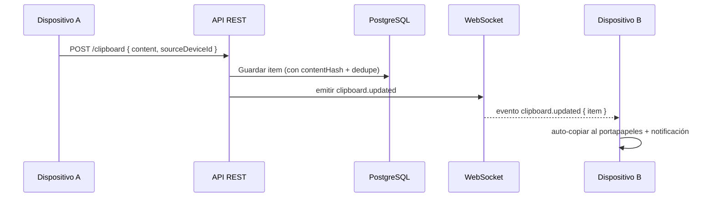
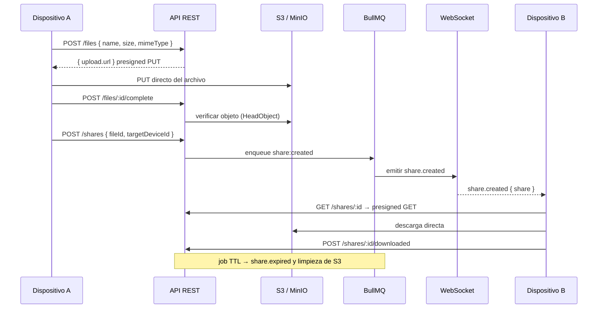
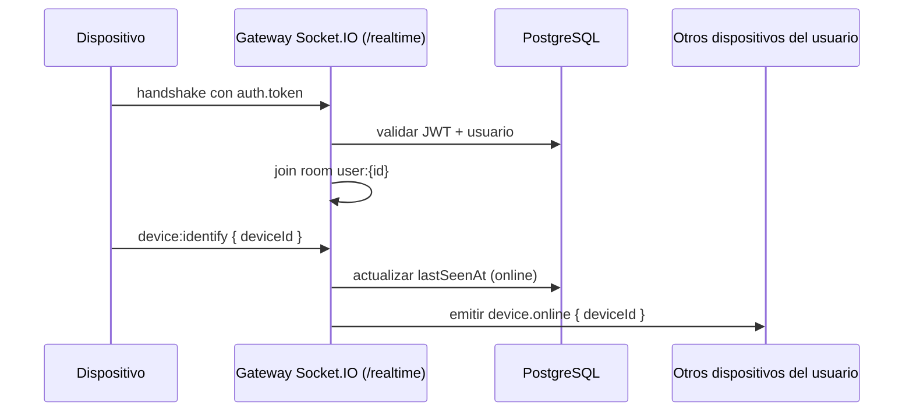

# Tether

Portapapeles y transferencia de archivos entre tus dispositivos (Windows, Linux, macOS, iOS y Android), vía cuenta + servidor central. Copia texto o arrastra un archivo en un dispositivo y pégalo en otro.

## Features

- **Autenticación JWT** — registro/login con access token corto y refresh token rotativo (revocación por reuso).
- **Dispositivos** — CRUD de tus dispositivos con estado online/offline (heartbeat + WebSocket).
- **Portapapeles** — push/pull de texto con historial, dedupe por contenido y notificación en tiempo real.
- **Archivos** — subida/descarga **directa cliente↔S3/MinIO** con presigned URLs (el servidor no actúa de buffer).
- **Realtime** — WebSocket (Socket.IO) con rooms por usuario y por dispositivo.
- **Transferencias** — shares de archivos entre dispositivos con cola BullMQ, eventos en vivo y TTL de expiración que limpia el storage.
- **Dashboard / estadísticas** — sección "Inicio" con métricas agregadas (archivos subidos, datos transferidos, compartidos, dispositivos, portapapeles) vía `GET /stats`.
- **API documentada** — OpenAPI/Swagger en `/docs` con todos los schemas.

## Stack técnico

| Capa | Tecnología |
|---|---|
| Backend | **NestJS 11** (Node + TypeScript, ESM) |
| Cliente desktop | **Tauri 2 + Vue 3** (TypeScript, Tailwind) |
| Cliente móvil | **Flutter** (referencia funcional) |
| Base de datos | **PostgreSQL 16** con **Prisma 7** |
| Realtime | **Socket.IO** |
| Queues/Jobs | **BullMQ + Redis** |
| Archivos | **S3 / MinIO** (presigned URLs) |
| Auth | **JWT** (access + refresh rotativo) |
| Tests | **Vitest** + **Supertest** |
| Logs | **pino** (estructurado) |

## Arquitectura

```
[Dispositivo A]  ──upload (presigned PUT)──▶  ┌──────────────────────────────┐
   (Flutter)                                  │  Backend NestJS (Cloud)       │
                                              │  ┌──────────────────────────┐ │
[Dispositivo B]  ◀──evento WebSocket───────── │  │ API REST + WebSocket     │ │
   (Flutter)     ◀──descarga (presigned GET)─ │  │ Auth/Devices/Clipboard/  │ │
                                              │  │ Files/Transfers          │ │
                                              │  ├──────────────────────────┤ │
                                              │  │ BullMQ (jobs/queues)     │ │
                                              │  └──────────────────────────┘ │
                                              │   │          │          │      │
                                              │  Postgres   Redis   S3/MinIO   │
                                              └──────────────────────────────┘
```

### Estructura del monorepo

```
Tether/
├── apps/
│   ├── backend/              # API NestJS (ESM + TypeScript strict)
│   │   ├── prisma/           # Schema y migraciones
│   │   ├── src/
│   │   │   ├── auth/         # Registro, login, refresh, JWT
│   │   │   ├── devices/      # CRUD + estado online
│   │   │   ├── clipboard/    # Push/pull de texto + historial
│   │   │   ├── files/        # Presigned URLs S3/MinIO
│   │   │   ├── transfers/    # Shares + BullMQ + TTL
│   │   │   ├── stats/        # Estadísticas agregadas (GET /stats)
│   │   │   ├── realtime/     # Gateway Socket.IO
│   │   │   └── ...
│   │   └── test/             # Tests e2e (Supertest)
│   ├── tether_tauri/         # Cliente desktop Tauri + Vue 3
│   │   └── src/
│   │       ├── features/     # auth, shell, dashboard, devices, clipboard, files
│   │       ├── stores/       # Pinia (auth, files, shares, stats, ...)
│   │       └── core/         # http, realtime, theme, types
│   └── tether_app/           # Cliente Flutter (referencia funcional)
├── shared/
│   ├── protocol/             # DTOs y eventos WS compartidos (futuro)
│   └── types/                # Tipos TS compartidos (futuro)
└── docs/
    ├── API.md                # Documentación de API y ambientes
    └── ROADMAP.md            # Visión y fases
```

## Quick Start (desarrollo)

### Prerrequisitos

- Node.js ≥ 20 (recomendado 24)
- pnpm ≥ 10
- Docker + Docker Compose

### Puesta en marcha

```bash
# 1. Instalar dependencias del monorepo
pnpm install

# 2. Levantar infraestructura (Postgres, Redis, MinIO)
pnpm db:up

# 3. Copiar variables de entorno y editar los secretos
cp apps/backend/.env.example apps/backend/.env

# 4. Aplicar migraciones de la base de datos
pnpm --filter @tether/backend exec prisma migrate dev

# 5. Arrancar el backend (watch mode)
pnpm dev:backend        # → http://localhost:3100
```

La API queda disponible en `http://localhost:3100` y la Swagger UI en `http://localhost:3100/docs`.

### App Tauri (desktop)

Cliente de escritorio (macOS/Windows/Linux) en `apps/tether_tauri`, renderizado en el webview de Tauri (HTML/CSS). Requiere [Rust](https://www.rust-lang.org/tools/install) y las [dependencias de Tauri](https://tauri.app/start/prerequisites/) por SO.

```bash
# App completa (Tauri + Vue): ventana nativa apuntando a la API local
pnpm --filter @tether/app-tauri dev

# Solo la UI en el navegador (dev rápido, sin shell nativo) → http://localhost:1420
pnpm --filter @tether/app-tauri dev:web
```

La app usa `VITE_API_BASE_URL` (ver `apps/tether_tauri/src/core/config.ts`); por defecto apunta a `http://localhost:3100`.

### Servicios de desarrollo

| Servicio | URL | Credenciales |
|---|---|---|
| API + Swagger | http://localhost:3100 `/docs` | — |
| PostgreSQL | `localhost:5434` (bd/user/pass: `tether`) | — |
| Redis | `localhost:6379` | — |
| MinIO (S3) | http://localhost:9002 | `minioadmin` / `minioadmin` |
| Consola MinIO | http://localhost:9001 | `minioadmin` / `minioadmin` |

> **Nota:** el puerto del Postgres dev es el **5434** (no 5432) y la API usa el **3100** (no 3000) para evitar conflictos con otros proyectos locales. El S3/MinIO usa el **9002** (no el 9000, ocupado por php-fpm/otros servicios). Ambos son configurables por variable de entorno.

## Ambientes

| Ambiente | URL base (ejemplo) | Uso |
|---|---|---|
| Desarrollo | `http://localhost:3100` | Máquina local de cada dev |
| QA / staging | `https://api-qa.tether.app` *placeholder* | Validación de integración |
| Producción | `https://api.tether.app` *placeholder* | Tráfico real |

Los despliegues de QA/prod usan **las mismas variables de entorno con valores distintos por ambiente**. En QA/prod se usa un Postgres/Redis administrado y S3 de AWS (o MinIO), con buckets separados (`tether-dev`, `tether-qa`, `tether-prod`).

```bash
# Deploy de un ambiente
pnpm --filter @tether/backend build                  # build ESM
pnpm --filter @tether/backend exec prisma migrate deploy
node apps/backend/dist/main.js
```

Verificación: `curl https://api.tether.app/health` debe devolver `{"status":"ok",...}` con los checks de dependencias `database`, `redis` y `storage`.

## Variables de entorno

Archivo de referencia: `apps/backend/.env.example`. La app **falla rápido** al arrancar si falta una variable obligatoria o es inválida (validación Joi).

| Variable | Obligatoria | Default | Descripción |
|---|---|---|---|
| `NODE_ENV` | No | `development` | `development`, `qa`, `production` o `test` |
| `PORT` | No | `3100` | Puerto HTTP de la API |
| `CORS_ORIGINS` | No | *(vacío = todos)* | Orígenes CORS separados por coma. `*` solo para dev |
| `DATABASE_URL` | **Sí** | — | Conexión PostgreSQL (`postgresql://...`) |
| `REDIS_HOST` / `REDIS_PORT` | No | `localhost` / `6379` | Conexión Redis (BullMQ) |
| `SHARE_TTL_DAYS` | No | `7` | Días de vida de un share antes de expirar |
| `MINIO_ENDPOINT` | **Sí** | — | Host del S3/MinIO |
| `MINIO_PORT` | No | `9002` | Puerto del S3/MinIO |
| `MINIO_USE_SSL` | No | `false` | Usar HTTPS contra S3 |
| `MINIO_ACCESS_KEY` | **Sí** | — | Access key S3 |
| `MINIO_SECRET_KEY` | **Sí** | — | Secret key S3 |
| `MINIO_BUCKET` | **Sí** | — | Bucket de objetos |
| `JWT_SECRET` | **Sí** (≥32 chars) | — | Firma de access tokens |
| `JWT_EXPIRES_IN` | No | `15m` | Duración del access token |
| `REFRESH_TOKEN_SECRET` | **Sí** (≥32 chars) | — | Firma de refresh tokens |
| `REFRESH_TOKEN_EXPIRES_IN` | No | `30d` | Duración del refresh token |
| `LOG_LEVEL` | No | `info` | Nivel de logs (pino) |

> **Seguridad:** `JWT_SECRET` y `REFRESH_TOKEN_SECRET` deben generarse con `openssl rand -hex 48` y ser **distintos por ambiente**. Nunca subas `.env` al repositorio.

## Endpoints

La API está documentada con OpenAPI. Swagger UI en `{BASE_URL}/docs` y spec JSON en `{BASE_URL}/docs-json`. Detalle completo en [`docs/API.md`](docs/API.md).

Todos los endpoints requieren `Authorization: Bearer <accessToken>`, excepto `auth/register`, `auth/login`, `auth/refresh`, `auth/logout`, `/health` y `/`.

### Auth
| Método | Ruta | Descripción |
|---|---|---|
| POST | `/auth/register` | Registrar usuario → tokens |
| POST | `/auth/login` | Iniciar sesión → tokens |
| POST | `/auth/refresh` | Rotar refresh token (el anterior queda revocado) |
| POST | `/auth/logout` | Revocar refresh token |
| GET | `/auth/me` | Perfil del usuario autenticado |
| PATCH | `/auth/profile` | Actualizar perfil (`name`, `avatarUrl`; vacío = usar Gravatar) |
| PATCH | `/auth/password` | Cambiar contraseña (`currentPassword`, `newPassword`) |

### Devices
| Método | Ruta | Descripción |
|---|---|---|
| POST | `/devices` | Registrar dispositivo (`name`, `platform`, `pushToken?`) |
| GET | `/devices` | Listar dispositivos propios con `isOnline` |
| GET | `/devices/:id` | Ver dispositivo propio |
| PATCH | `/devices/:id` | Renombrar / actualizar pushToken |
| DELETE | `/devices/:id` | Desvincular dispositivo |
| POST | `/devices/:id/heartbeat` | Marcar online (ventana de 2 min) |

### Clipboard
| Método | Ruta | Descripción |
|---|---|---|
| POST | `/clipboard` | Subir texto (`content`, `sourceDeviceId?`). Dedupe por contenido+device |
| GET | `/clipboard/latest` | Último texto |
| GET | `/clipboard/history?limit=N` | Historial (default 20, máx 100) |

### Files
| Método | Ruta | Descripción |
|---|---|---|
| POST | `/files` | Registrar archivo → presigned PUT URL (TTL 15 min) |
| GET | `/files` | Listar archivos |
| GET | `/files/:id` | Presigned GET URL de descarga (TTL 1 h) |
| POST | `/files/:id/complete` | Confirmar subida (verifica en S3) |
| DELETE | `/files/:id` | Borrar registro + objeto S3 |

### Transfers (`/shares`)
| Método | Ruta | Descripción |
|---|---|---|
| POST | `/shares` | Crear share (`fileId`, `targetDeviceId?`) |
| GET | `/shares?status=` | Listar shares (`CREATED`/`ACCEPTED`/`DOWNLOADED`/`EXPIRED`) |
| GET | `/shares/:id` | Detalle + presigned URL de descarga |
| POST | `/shares/:id/accept` | Aceptar share |
| POST | `/shares/:id/downloaded` | Marcar como descargado |
| POST | `/shares/:id/cancel` | Cancelar share |

### Stats
| Método | Ruta | Descripción |
|---|---|---|
| GET | `/stats` | Estadísticas agregadas del usuario: `filesUploaded`, `filesTotalSize` (bytes), `shares`, `devices`, `clipboardItems` |

### Sistema
| Método | Ruta | Descripción |
|---|---|---|
| GET | `/health` | Health check con dependencias (`database`, `redis`, `storage`) |
| GET | `/` | Nombre y estado del servicio |

### WebSocket

Conexión en `/realtime` con el access token en el handshake:

```js
const socket = io(BASE_URL, { path: '/realtime', auth: { token: accessToken } });
socket.emit('device:identify', { deviceId });
```

Eventos del servidor: `device.online`, `device.offline`, `clipboard.updated`, `file.ready`, `share.created`, `share.accepted`, `share.downloaded`, `share.expired`.

## Flujos end-to-end

### Copiar texto A → pegar en B



### Enviar archivo A → B



### Conexión realtime



## Desarrollo

Scripts disponibles:

```bash
# Backend
pnpm dev:backend          # watch mode
pnpm --filter @tether/backend build
pnpm --filter @tether/backend lint
pnpm --filter @tether/backend test        # unit (Vitest)
pnpm --filter @tether/backend test:e2e    # e2e (Supertest, requiere infra arriba)

# App Tauri (desktop)
pnpm --filter @tether/app-tauri dev          # Tauri + Vue (ventana nativa)
pnpm --filter @tether/app-tauri dev:web      # solo UI en el navegador
pnpm --filter @tether/app-tauri build        # tauri build (bundle nativo)
pnpm --filter @tether/app-tauri typecheck    # vue-tsc --noEmit

# Base de datos (Prisma)
pnpm --filter @tether/backend prisma:generate
pnpm --filter @tether/backend prisma:migrate
pnpm --filter @tether/backend prisma:studio

# Infra
pnpm db:up
pnpm db:down
```

### Convenciones

- Backend en **ESM** (`"type": "module"` + `module: NodeNext`, imports con `.js`).
- **TypeScript estricto** (`strict`, `noUnusedLocals`, `verbatimModuleSyntax`).
- Módulos por feature, DTOs validados con class-validator, respuestas tipadas documentadas en Swagger.
- Tests: Vitest + SWC (decorators) para unit, Supertest para e2e.

## Documentación

- [`docs/API.md`](docs/API.md) — documentación completa de la API, ambientes (dev/QA/prod), endpoints y eventos WebSocket.
- [`docs/ROADMAP.md`](docs/ROADMAP.md) — visión, arquitectura y fases del producto.

## Fases del roadmap

| Fase | Alcance |
|---|---|
| **1. MVP (cloud)** | Auth + dispositivos + clipboard + archivos con progreso y notificaciones *(completado en el backend)* |
| **2. P2P LAN** | Transferencia directa por red local (WebRTC/TCP), el servidor solo coordina |
| **3. Sin internet** | Pairing BLE + transferencia por Bluetooth / WiFi directo |
| **4. Monetización** | Planes por volumen/ancho de banda (Stripe metered) |
